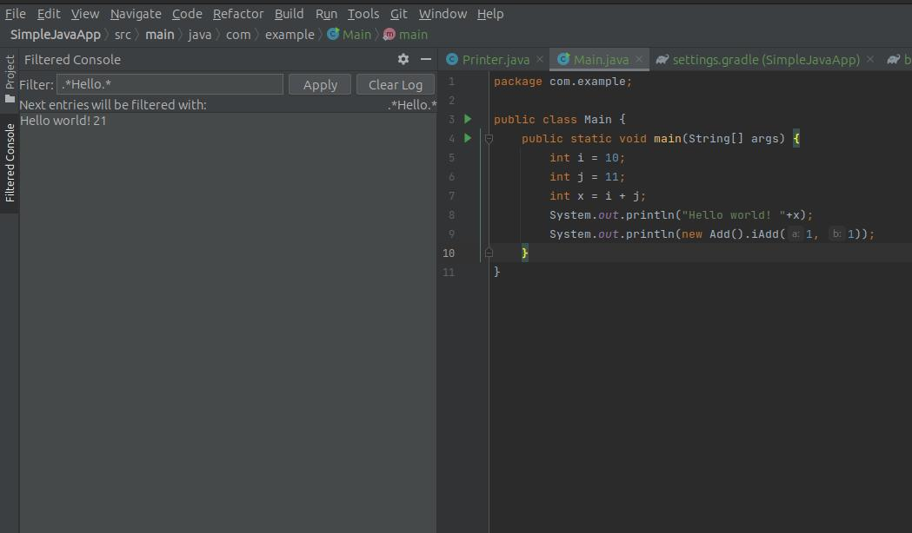

# Live Console filter for intellij

This will filter the console according to a given regex.  
The new entries are checked against the current regex, and if they match, the entry is logged.  
Check the releases for the plugin.  

[Download](https://github.com/beothorn/ConsoleFilterForIntellij/releases/download/1.0/consoleFilterForIntellij-1.0.jar)

To install got to Plugins > Gear Icon > Install plugin from disk 